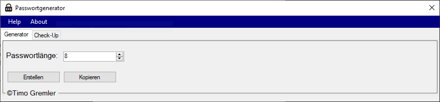
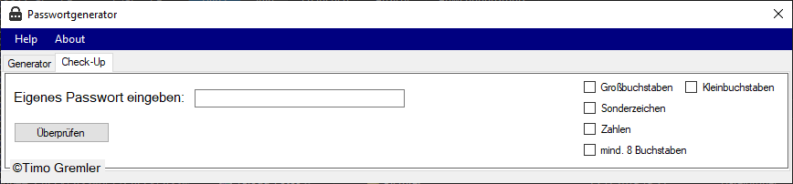
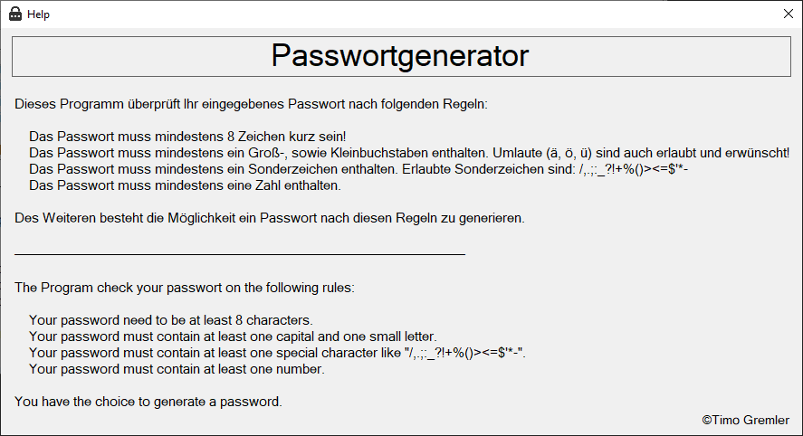

# Passwortgenerator

To start the program, launch "Passwortgenerator.exe".

Under "Generator", you can create a password. The button "Kopieren" copied the password to your clipboard. 

Under "Check-Up you can check your password.

Under "Help" you can find the rules how the password is reviewed.

